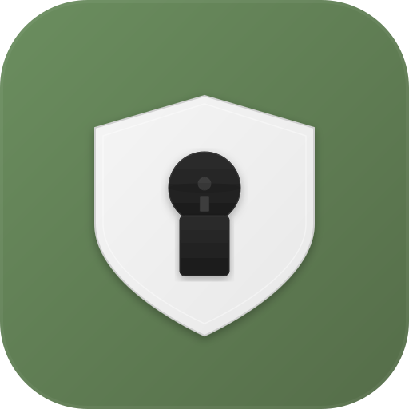
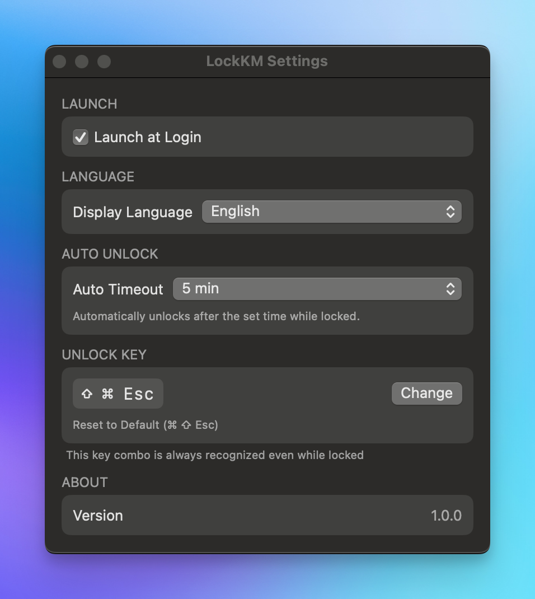
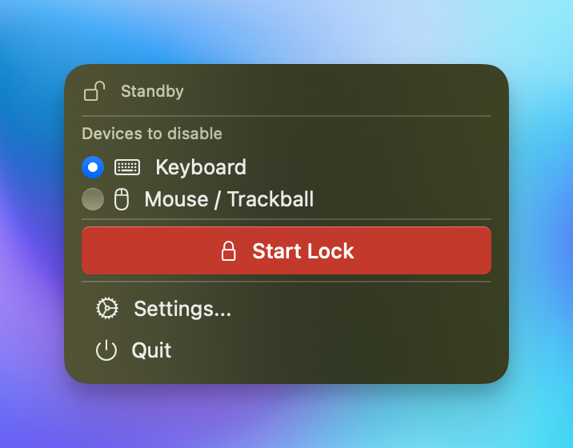
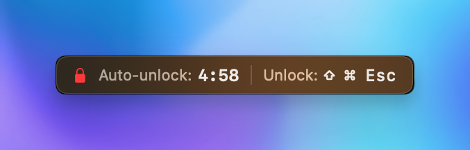

# LockKM

  

  <strong>キーボード・マウスを一時的にロックするmacOSユーティリティ</strong>

  <a href="README.md">English</a> | 日本語

---

お子さんがキーボードやマウスを誤って操作するのを防ぎたい。プレゼンテーション中の不意な入力を避けたい。キーボードやマウスを掃除するときに誤入力を防ぎたい。そんなときに **LockKM** が役立ちます。

ワンクリックでキーボード・マウスをロックし、設定したキーコンボで即座に解除。自動アンロック機能付きで安心して使えます。

## スクリーンショット

| 設定画面 | メニューバー | ロック中オーバーレイ |
|:---:|:---:|:---:|
|  |  |  |

## 機能

### デバイスロック

- **キーボード系ロック** - キーボード・テンキーの入力を無効化
- **ポインティングデバイス系ロック** - マウス・トラックボールの移動・クリック・スクロールを無効化し、カーソル位置を固定
- **選択式ロック** - どちらかのデバイスグループを選んでロック

### アンロック

- **カスタムキーコンボ** - 任意のキーの組み合わせでロック解除（デフォルト: `⌘ ⇧ Esc`）
- **キーコンボレコーダー** - 設定画面から直感的にキーコンボを記録・変更
- **自動アンロック** - 設定時間（30秒〜1時間）経過で自動的にロック解除

### 安全機能

- **セーフティタイマー** - ロック中は常にカウントダウンを表示
- **オーバーレイHUD** - 画面右上に残り時間と解除キーを常時表示
- **強制タイムアウト** - 万が一の場合も自動アンロックで安全を確保
- **再起動で解除** - Macを再起動するとロックは自動的に解除

### メニューバー統合

- **ワンクリック操作** - メニューバーからロック/アンロックを即座に切り替え
- **ステータス表示** - ロック状態をアイコンの色で一目で確認
- **デバイス選択** - メニューバーから直接ロック対象デバイスを変更
- **ドック非表示** - メニューバーアプリとして動作し、ドックを占有しない

### 多言語対応

7言語をサポート:

| 言語 | コード |
|------|--------|
| English | en |
| 日本語 | ja |
| Español | es |
| Français | fr |
| 한국어 | ko |
| 简体中文 | zh-Hans |
| 繁體中文 | zh-Hant |

### その他

- **ログイン時自動起動** - macOSのログイン項目に登録して自動起動
- **軽量設計** - 最小限のリソース使用でバックグラウンド動作

## 動作環境

| 項目 | 要件 |
|------|------|
| OS | macOS 14 (Sonoma) 以降 |
| プロセッサ | Apple Silicon / Intel |
| 権限 | アクセシビリティ権限が必要 |

## インストール

1. [Releases](../../releases) ページから最新版をダウンロード
2. `.dmg` を開き、LockKM を Applications フォルダにドラッグ
3. LockKM を起動
4. システム設定 > プライバシーとセキュリティ > アクセシビリティ で LockKM を許可

> **注意**: 初回起動時にアクセシビリティ権限の許可が必要です。この権限はキーボード・マウスイベントの制御に使用されます。

## 使い方

1. メニューバーの LockKM アイコンをクリック
2. ロックしたいデバイスグループを選択（キーボード / マウス）
3. 「ロック」ボタンをクリック
4. ロックを解除するには、設定したキーコンボを入力（デフォルト: `⌘ ⇧ Esc`）

## ライセンス

BSD 3-Clause License - 詳細は [LICENSE](LICENSE) をご覧ください。

LockKM は2026年からMac向けに無料で提供されています。
